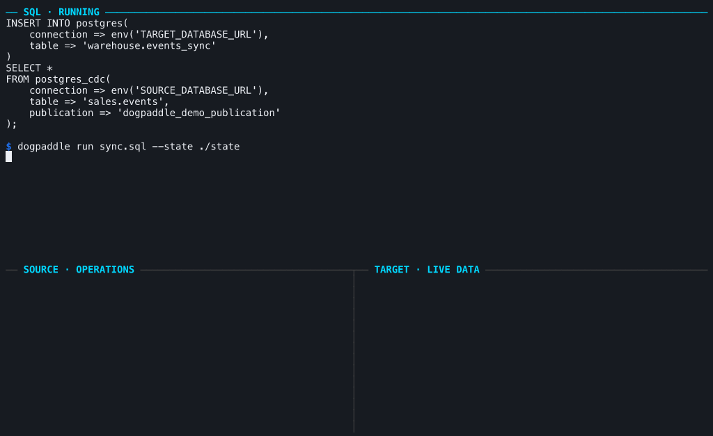
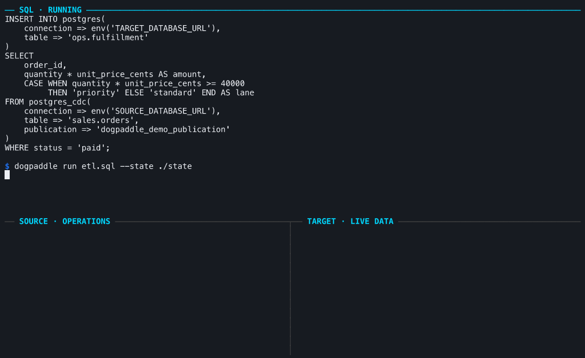
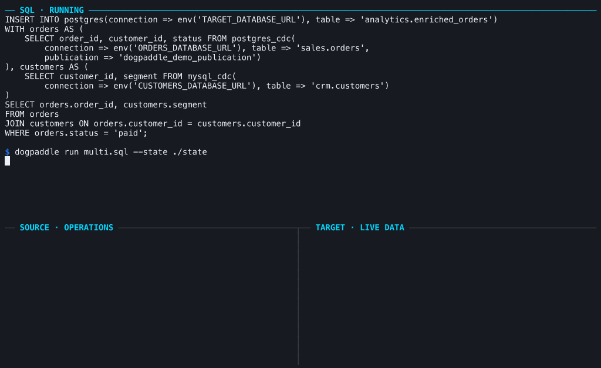

# DogPaddle

**一条 SQL，持续把数据库变化变成另一个数据库中的结果。**

```text
PostgreSQL / MySQL  ── CDC ──▶  SQL  ──▶  PostgreSQL / SQLite
```

DogPaddle 是一个本地运行、可恢复的实时数据引擎。它先读取一致快照，再持续消费 WAL 或 binlog；进程重启后，从已提交的位置继续。

下面都是实际终端录制：真实数据库写入，真实 DogPaddle 运行结果。

[](https://github.com/frelion/dogpaddle/actions/workflows/ci.yml)
[](https://github.com/frelion/dogpaddle/actions/workflows/debezium-postgres.yml)

## 1. 数据同步

把 PostgreSQL 或 MySQL 的数据变化持续同步到 PostgreSQL 或 SQLite。源表发生 `INSERT`、`UPDATE`、`DELETE`，目标表随之改变。



```sql
INSERT INTO postgres(
    connection => env('TARGET_DATABASE_URL'),
    table => 'warehouse.events'
)
SELECT * FROM postgres_cdc(
    connection => env('SOURCE_DATABASE_URL'),
    table => 'sales.events',
    publication => 'events_publication'
);
```

## 2. 实时 ETL

同步之外，直接在数据变化上执行筛选、计算、聚合、去重和路由。结果不是周期性重建，而是持续更新。



核心转换就是普通 SQL：

```sql
SELECT
    order_id,
    quantity * unit_price_cents AS amount,
    CASE WHEN quantity * unit_price_cents >= 40000
         THEN 'priority' ELSE 'standard' END AS lane
FROM orders
WHERE status = 'paid';
```

[查看完整的订单履约 SQL](crates/sql/examples/fulfillment.sql)

## 3. 多源数据库

在同一条 SQL 中同时读取 PostgreSQL 和 MySQL，实时 Join 后写入一个目标数据库。



```sql
INSERT INTO postgres(
    connection => env('TARGET_DATABASE_URL'),
    table => 'analytics.orders'
)
WITH orders AS (
    SELECT order_id, customer_id
    FROM postgres_cdc(
        connection => env('ORDERS_DATABASE_URL'),
        table => 'sales.orders',
        publication => 'orders_publication'
    )
), customers AS (
    SELECT customer_id, segment
    FROM mysql_cdc(
        connection => env('CUSTOMERS_DATABASE_URL'),
        table => 'crm.customers'
    )
)
SELECT orders.order_id, customers.segment
FROM orders
JOIN customers
  ON orders.customer_id = customers.customer_id;
```

任一数据源发生变化，DogPaddle 都会更新对应的 Join 结果。

## 快速开始

从 [GitHub Releases](https://github.com/frelion/dogpaddle/releases) 下载压缩包。发行包已包含固定版本的 Debezium 与 JRE，无需安装 Rust 或系统 Java。

```sh
dogpaddle run pipeline.sql --state ./state
```

每个 SQL 文件只描述一条数据管道：

```sql
INSERT INTO target(...) <query>;
```

再次执行同一条命令即可恢复。DogPaddle 不会在恢复失败时删除或偷偷重建已有状态。

## 当前能力

| | 支持 |
| --- | --- |
| 数据源 | PostgreSQL CDC、MySQL CDC |
| SQL | `SELECT`、`WHERE`、表达式、`JOIN`、`GROUP BY`、`DISTINCT`、`UNION ALL` |
| 聚合 | `COUNT`、`SUM`、`AVG`、`MIN`、`MAX` |
| 目标端 | PostgreSQL、SQLite |
| 恢复 | 本地持久化进度、拓扑和算子状态 |

DogPaddle 仍处于早期开发阶段。CDC 当前要求固定 Schema，暂不支持 TLS、在线 DDL 或多表路由；完整约束见 [SQL 文档](crates/sql/README.md)。

## 文档

- [SQL、端点与运行方式](crates/sql/README.md)
- [完整订单履约演示](docs/demo/README.md)
- [构建、测试与性能验证](TESTING.md)
- [底层 Flow API](crates/flow/README.md)
