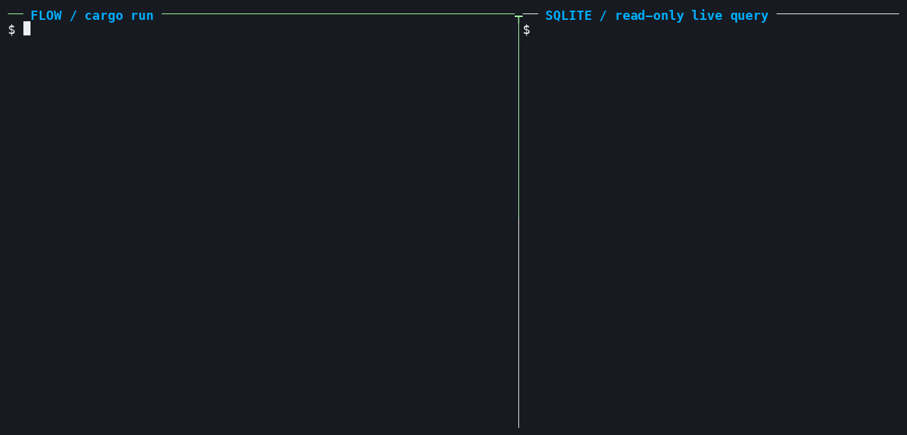

# DogPaddle

[](https://github.com/frelion/dogpaddle/actions/workflows/ci.yml)

**把可恢复的数据流，嵌进 Rust 进程。**

DogPaddle 是一个为 Rust 应用设计的嵌入式 Dataflow 引擎。它用 Arrow 和 DataFusion 处理数据，
并把静态 Flow、消费进度与算子状态保存在本地事务 Store 中。应用重启后，可以从已提交位置
重新打开并继续推进。

无需独立服务、控制面或流处理集群。



*真实 PTY 录制：左侧运行公共 API Flow，右侧用只读 `sqlite3` 查看 `SQLiteSink`
持续落库；450 ms 停顿仅用于演示。*

[查看并运行示例](crates/flow/examples/sqlite_sink_live.rs)

## 为什么是 DogPaddle

- **状态随 Flow 持久化**：拓扑、游标与算子进度统一保存在本地 MDBX，重启后从已提交位置继续。
- **先验证，再落盘**：完整 DAG 和 Arrow Schema 通过后才创建资源；不完整构建不会被打开为 Flow。
- **Arrow + DataFusion**：Arrow 承载批量差分，DataFusion 执行类型化、向量化表达式。
- **推进权留给应用**：每次 `Flow::advance` 只做有界工作，应用决定运行节奏，慢消费者自然形成软背压。

## 立即体验

```sh
demo_dir="$(mktemp -d /tmp/dogpaddle-demo.XXXXXX)"
cargo run --locked -q -p dogpaddle-flow --example sqlite_sink_live -- "$demo_dir" 10 0
sqlite3 -readonly -header -column "$demo_dir/events.sqlite" \
  'SELECT "$dogpaddle.id" AS id, number, square FROM even_squares ORDER BY id;'
```

需要 Rust 1.96+ 与 `sqlite3` 命令行。

## 已实现

| Source | Transform | Sink |
| --- | --- | --- |
| `SequenceSource` | `RunningEventCount` · `Project` · `Filter` · `Extend` · `Select` · `SchemaAlign` · `UnionAll` | `SqliteSink` · `Discard` |

`SQLiteSink` 首次收到输入后延迟初始化普通 `STRICT` 表，不引入额外 SQLite 元数据表。
它支持 DogPaddle v1 的全部数据类型，并为 SQLite 与 MDBX 之间的提交窗口保存可重放批次；
在 Sink 独占目标表且数据库未被外部修改或替换的前提下，重放不会重复最终结果。

## 当前边界

- DogPaddle 目前仍是早期引擎内核，优先打磨持久化、恢复和 Schema 边界。
- 运行由宿主反复调用 `Flow::advance` 驱动；尚无 `Flow::start`、后台 runner 或中断控制。
- Operation 集合目前封闭，唯一内建 Source 是 `SequenceSource`，尚无生产输入连接器。
- 一个 Store 路径同一时刻只允许一个活动 Flow。
- `SQLiteSink` 只创建并独占新目标表；尚无 PostgreSQL、MySQL 或通用外部 Sink。
- 当前是开发期 v1，持久格式显式版本化并经过 golden 测试，但不提供跨版本迁移承诺。

## 深入阅读

- [算子路线与语义边界](OPERATOR_ROADMAP.md)
- [Flow：构建、运行与恢复](crates/flow/README.md)
- [Change：Arrow 差分与 IPC](crates/change/README.md)
- [Operation：定义、Schema 绑定与执行](crates/operation/README.md)
- [Store：MDBX 事务与集合](crates/store/README.md)
- [重新生成真实录屏](tools/record_sqlite_sink_live.sh)
- [SQLiteSink 端到端测试](crates/flow/tests/correctness/sqlite_sink.rs)
- [正确性与性能测试](TESTING.md)
