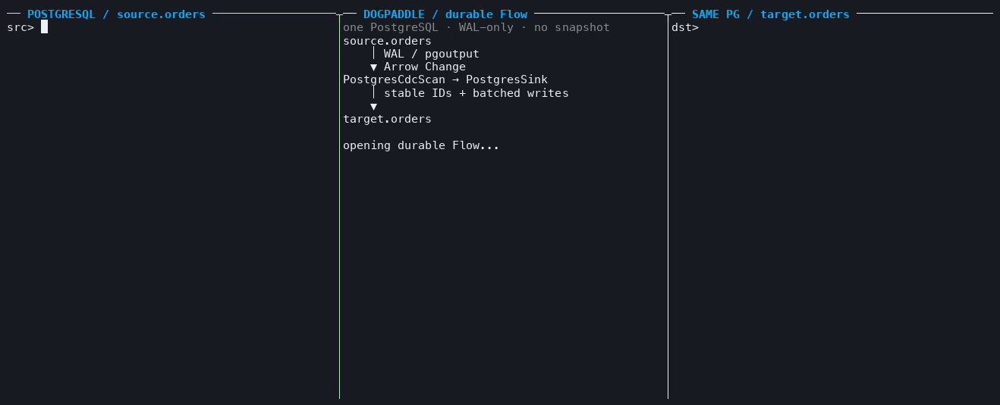

# DogPaddle

[](https://github.com/frelion/dogpaddle/actions/workflows/ci.yml)
[](https://github.com/frelion/dogpaddle/actions/workflows/debezium-runtime.yml)
[](https://github.com/frelion/dogpaddle/actions/workflows/debezium-postgres.yml)

**把可恢复的数据流，嵌进 Rust 进程。**

DogPaddle 是一个为 Rust 应用设计的嵌入式 Dataflow 引擎。它用 Arrow 和 DataFusion 处理数据，
并把静态 Flow、消费进度与算子状态保存在本地事务 Store 中。应用重启后，可以从已提交位置
重新打开并继续推进。

无需独立服务、控制面或流处理集群。



*真实进程录制：左侧写入 PostgreSQL，中间运行 `PostgresSource → SqliteSink` Flow，右侧用只读
`sqlite3` 查看 `SqliteSink` 的结果；停顿仅用于演示。*

[查看 Flow host](crates/flow/examples/postgres_cdc.rs) ·
[重新生成录屏](tools/record_postgres_cdc_live.sh)

## 为什么是 DogPaddle

- **状态随 Flow 持久化**：拓扑、游标与算子进度统一保存在本地 MDBX，重启后从已提交位置继续。
- **先验证，再落盘**：完整 DAG 和 Arrow Schema 通过后才创建资源；不完整构建不会被打开为 Flow。
- **Arrow + DataFusion**：Arrow 承载批量差分，DataFusion 执行类型化、向量化表达式。
- **推进权留给应用**：每次 `Flow::advance` 只做有界工作，应用决定运行节奏，慢消费者自然形成软背压。

## 立即体验

```sh
demo_dir="$(mktemp -d /tmp/dogpaddle-demo.XXXXXX)"
cargo run --locked -q -p dogpaddle-flow --example sqlite_sink_live -- "$demo_dir" 10 0
sqlite3 -readonly -header -column "$demo_dir/events.sqlite" \
  'SELECT "$dogpaddle.id" AS id, number, square FROM even_squares ORDER BY id;'
```

需要 Rust 1.96+ 与 `sqlite3` 命令行。

## 已实现

当前共有 12 个内建算子，全部沿用同一套 Definition、Schema binding、Operation turn 与 Flow 调度协议。

| Source | Transform | Sink |
| --- | --- | --- |
| `SequenceSource` · `PostgresSource`（试点） | `RunningEventCount` · `Project` · `Filter` · `Extend` · `Select` · `SchemaAlign` · `UnionAll` | `SqliteSink` · `PostgresSink`（试点） · `Discard` |

`SqliteSink` 首次收到输入后延迟初始化普通 `STRICT` 表，不引入额外 SQLite 元数据表。
它支持 DogPaddle v1 的全部数据类型，并为 SQLite 与 MDBX 之间的提交窗口保存可重放批次；
在 Sink 独占目标表且数据库未被外部修改或替换的前提下，重放不会重复最终结果。

`PostgresSink` 用同一套 Flow API 把单输入 exact relation 物化到独占的固定 Schema PostgreSQL
目标。Definition 只保存非敏感 target spec，连接配置在 build/open 时以运行资源注入；每个至多
1024 项的持久 Prepared 批次在 `AfterCommit` 中把一行 receipt 与全部 mutation 提交到同一 PG
事务，下一 turn 再以 `Complete` 完成输入或以 `Commit` 保存 continuation。这里没有公共通用 Sink
trait 或 ORM 抽象。

CDC 基础设施已经有独立的 `dogpaddle-debezium` 产品 crate：它在 Rust 进程内运行 stock
Debezium Engine，以 connector-neutral 的 `start/poll/ack/stop` 和 opaque pre-ACK checkpoint
隔离 JNI。Linux GNU 与 macOS 的 x86_64/aarch64 自包含 bundle 随附固定 Temurin JRE，运行时不依赖
系统 Java。`PostgresSource` 已接到同一 Operation 协议：单表、固定 Schema 的 WAL 事件转换为
Change，checkpoint 与 Station output 同事务落盘后才 ACK，不另存 pending 中转。
运行配置显式装配，密码不进入 Definition。
这是持续 CDC 试点，不是生产发布承诺；[使用与边界](crates/operation/README.md#postgresql-source-试点)。

## 当前边界

- DogPaddle 目前仍是早期引擎内核，优先打磨持久化、恢复和 Schema 边界。
- 运行由宿主反复调用 `Flow::advance` 驱动；尚无 `Flow::start`、后台 runner 或中断控制。
- Operation 集合目前封闭。`PostgresSource` 暂不包含初始全量、多表路由、在线 Schema evolution、TLS
  配置或跨 Flow fencing；首个关系物化链路须从空表和匹配的 slot 起点开始。生产加固仍属于 D5。
- 一个 Store 路径同一时刻只允许一个活动 Flow。
- `SqliteSink` 与 `PostgresSink` 都只创建并独占新目标表；后者不支持 TLS、在线 Schema evolution、
  target spec 的跨 Flow 接管/共享、外部改表/改数据或数据库替换恢复。尚无 MySQL 或通用外部 Sink。
- 当前是开发期 v1，持久格式显式版本化并经过 golden 测试，但不提供跨版本迁移承诺。

## 深入阅读

- [算子路线与语义边界](OPERATOR_ROADMAP.md)
- [Debezium Source D0–D7 路线图](DEBEZIUM_ROADMAP.md)
- [ADR-0001：在 Rust 宿主中嵌入 Debezium Engine](docs/adr/0001-embed-debezium-engine.md)
- [Debezium：自包含进程内 Engine 与 pre-ACK checkpoint](crates/debezium/README.md)
- [Flow：构建、运行与恢复](crates/flow/README.md)
- [Change：Arrow 差分与 IPC](crates/change/README.md)
- [Operation：定义、Schema 绑定与执行](crates/operation/README.md)
- [Store：MDBX 事务与集合](crates/store/README.md)
- [重新生成 PostgreSQL CDC 录屏](tools/record_postgres_cdc_live.sh)
- [PostgreSQL Sink 真实验收](tools/check_postgres_sink.py)
- [重新生成 SQLite Sink 录屏](tools/record_sqlite_sink_live.sh)
- [SqliteSink 端到端测试](crates/flow/tests/correctness/sqlite_sink.rs)
- [正确性与性能测试](TESTING.md)
