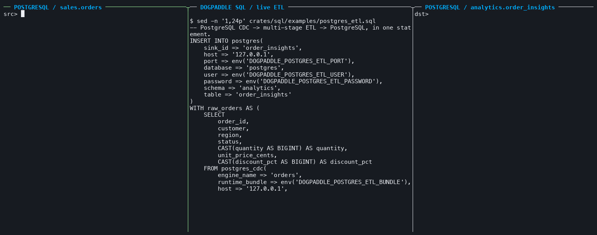

# DogPaddle

[](https://github.com/frelion/dogpaddle/actions/workflows/ci.yml)
[](https://github.com/frelion/dogpaddle/actions/workflows/debezium-runtime.yml)
[](https://github.com/frelion/dogpaddle/actions/workflows/debezium-postgres.yml)

**业务照常写 PostgreSQL。DogPaddle 读取 WAL，用一份 SQL 实时完成 ETL，再写回同一个 PostgreSQL。**



*真实进程录制：上方左侧是业务源表 `sales.orders` 的实际写入，上方右侧是同一 PostgreSQL 实例、
同一个 `postgres` 数据库内的 `analytics.order_insights`，底部固定显示 `postgres_etl.sql` 的数据路径和
当前阶段。源表的 `INSERT`、`UPDATE` 和 `DELETE` 会经过计算、筛选、分类与分流合并，实时改变目标关系；
宿主被 `SIGKILL` 后用同一 state
重新打开，已提交结果不重复，后续变化继续到达。录制从空源表和新 slot 起步；当前试点不做初始快照。*

[查看完整 SQL](crates/sql/examples/postgres_etl.sql) ·
[查看录屏宿主](crates/sql/examples/postgres_etl_live.rs) ·
[重新生成真实录屏](docs/tools/record_postgres_etl_live.sh) ·
[查看 PostgreSQL 系统验收](system-tests/postgres/check_sql.py)

这条链路只需要一个 PostgreSQL：后端继续维护自己的源表，DogPaddle 通过进程内 Debezium/JRE
运行时捕获 WAL，并独占维护另一个 schema 中的派生表。业务代码不需要双写，也不需要部署独立的
流处理服务、控制面或集群。

```text
backend writes
      │
      ▼
sales.orders ── WAL / postgres_cdc ──▶ CTE / CAST / arithmetic / CASE / WHERE
   (same PostgreSQL)                                      │
                                                         ▼
                                           analytics.order_insights
                                              (same PostgreSQL)
```

一条 `INSERT INTO ... SELECT ...` 就是完整 Flow：Scan、转换和 Sink 都在同一个 SQL 文件里。
DataFusion 负责 SQL 名称与类型分析，Arrow 承载变化批次，MDBX 保存 canonical Flow、游标和算子状态；
应用通过很小的 Rust API 控制构建、推进和恢复。

## 快速上手

准备仓库固定的 Rust 1.96 和 `sqlite3` 命令行，然后在仓库根目录运行：

```sh
demo_dir="$(mktemp -d /tmp/dogpaddle-demo.XXXXXX)"
export DOGPADDLE_QUICKSTART_SQLITE="$demo_dir/results.sqlite"

cargo run --locked -q -p dogpaddle-sql --example quickstart -- \
  build crates/sql/examples/quickstart.sql "$demo_dir/flow" 12 0

sqlite3 -readonly -header -column "$DOGPADDLE_QUICKSTART_SQLITE" \
  'SELECT "$dogpaddle.id" AS id, number, square, size FROM even_squares ORDER BY id;'
```

第一次运行会得到 `0, 2, 4, 6, 8`。现在用同一份 SQL 和同一个 state 目录恢复：

```sh
cargo run --locked -q -p dogpaddle-sql --example quickstart -- \
  open crates/sql/examples/quickstart.sql "$demo_dir/flow" 6 0

sqlite3 -readonly -header -column "$DOGPADDLE_QUICKSTART_SQLITE" \
  'SELECT "$dogpaddle.id" AS id, number, square, size FROM even_squares ORDER BY id;'
```

结果会继续增加 `10` 和 `12`。`sequence` 是持续 Scan；quickstart 宿主按参数执行有限轮
`Flow::advance` 后主动退出，以便直接看到恢复行为。实际应用自行决定推进频率和停止时机。


*这个本地 quickstart 只依赖 SQLite：先 `build`，再用同一份 SQL 和 state `open`；恢复后继续写入，
已有结果没有重复。*

[查看 quickstart SQL](crates/sql/examples/quickstart.sql) ·
[查看 quickstart 宿主](crates/sql/examples/quickstart.rs) ·
[重新生成 quickstart 录屏](docs/tools/record_sql_quickstart.sh)

## 一个文件就是一条完整 Flow

quickstart 使用的文件没有 Pipeline DDL、Table、View、Catalog 或旁路配置：

```sql
-- One statement defines Scan -> Transform -> Sink.
INSERT INTO sqlite(
    path => env('DOGPADDLE_QUICKSTART_SQLITE'),
    table => 'even_squares'
)
WITH numbers AS (
    SELECT CAST(sequence.value AS BIGINT) AS number
    FROM sequence(start => 0)
)
SELECT
    number,
    number * number AS square,
    CASE WHEN number >= 10 THEN 'large' ELSE 'small' END AS size
FROM numbers
WHERE number % 2 = 0;
```

这条语句直接形成：

```text
sequence(...)  →  CTE / CAST / WHERE / CASE  →  sqlite(...)
     Scan                    Transform                 Sink
```

`build` 先完成 DataFusion 分析、全图 Schema binding 和拓扑校验，再创建 canonical Flow。
`open` 从磁盘恢复已经提交的 Definition、进度和算子状态，并注入当前运行需要的连接资源。
凭据可以通过 `env('NAME')` 读取，错误不会打印解析后的秘密。

## 为什么是 DogPaddle

- **SQL 直接描述数据去向**：一个文件覆盖 Scan、转换和 Sink，Rust 宿主只负责生命周期。
- **恢复是 Flow 的基本语义**：Flow Definition 持久保存；游标与算子进度按提交边界恢复，外部 Sink
  通过可重放状态收敛。
- **先验证，再落盘**：SQL、DAG 和 Arrow Schema 全部通过后才创建 state 目录。
- **Arrow + DataFusion**：变化以 Arrow 批次流动，表达式使用 DataFusion 的类型与向量执行语义。
- **运行节奏属于应用**：一次 `Flow::advance` 只做有界工作，慢消费者通过持久输出形成软背压。

Rust 中的宿主接口保持很小：

```rust
use dogpaddle_sql::SqlProgram;

let program = SqlProgram::read("flow.sql")?;
let mut flow = program.build("./flow-state")?;
flow.advance()?;

drop(flow);
let mut flow = program.open("./flow-state")?;
flow.advance()?;
```

## 当前能力

| 层 | 已实现 |
| --- | --- |
| SQL Scan | `sequence(...)`、`postgres_cdc(...)`（试点） |
| SQL Transform | `SELECT`、`WHERE`、字段别名、非递归 CTE、派生查询、`CAST`、`TRY_CAST`、`CASE`、`UNION ALL` |
| SQL Sink | `sqlite(...)`、`postgres(...)`（试点）、`discard()` |
| 运行与恢复 | canonical Flow Definition、持久游标、算子状态、软背压、`Flow::status`、build/open/reopen |
| 数据模型 | Arrow Schema、批量差分 Change、完整自描述 Arrow IPC Stream |

底层目前有 12 个内建 Operation：`SequenceScan`、`PostgresCdcScan`、`RunningEventCount`、
`Project`、`Filter`、`Extend`、`Select`、`SchemaAlign`、`UnionAll`、`SqliteSink`、
`PostgresSink` 和 `Discard`。新增 SQL 能力通过明确的 LogicalPlan lowering 映射到这些 Operation，
运行仍由同一套 Flow 协议负责。

## 当前边界

- DogPaddle 仍是早期引擎内核，持久化和恢复已有系统验收，生产加固仍在进行。
- SQL v1 是明确受限的 streaming SQL 子集。Join、Aggregate、普通 `UNION`、Distinct、Sort、Limit、
  Window、表达式子查询和依赖函数 registry 的函数会在创建 state 目录前被拒绝。
- 一个 SQL 文件只接受一条直接写入一个 Sink 的 `INSERT ... SELECT`；没有 DDL、Catalog、查询结果返回
  或自动运行循环。
- `open` 以磁盘中的 canonical Flow Definition 为准。修改 SQL 不会热更新已有 Flow；拓扑变更需要新的
  state 目录，并为独占 Sink 使用新的目标。
- 一个 state 路径同一时刻只允许一个活动 Flow。SQLite 和 PostgreSQL Sink 都独占自己创建的目标表。
- PostgreSQL 试点必须从空源表和匹配的新 slot 起点开始；它没有初始全量，不能直接接管已有数据的
  非空业务表。目前也没有多表路由、TLS、DNS endpoint、在线 Schema evolution 或跨 Flow fencing。
- `PostgresSink` 创建并独占无损 Arrow 关系表，不镜像源表 DDL；当前文本值按 bytes 保存，所以示例
  查询使用 `convert_from(...)`。完整约束见 [Operation 文档](crates/operation/README.md)。
- 当前持久格式经过 golden 与 reopen 测试，但开发期 v1 不提供跨版本迁移承诺。

## 深入阅读

- [SQL：语法、生命周期与可运行 quickstart](crates/sql/README.md)
- [Flow：构建、运行与恢复](crates/flow/README.md)
- [Operation：算子、Schema 绑定与外部端点](crates/operation/README.md)
- [Change：Arrow 差分与 IPC](crates/change/README.md)
- [Store：MDBX 事务与集合](crates/store/README.md)
- [Debezium：自包含进程内 Engine 与 pre-ACK checkpoint](crates/debezium/README.md)
- [算子路线与语义边界](OPERATOR_ROADMAP.md)
- [Debezium Scan D0–D7 路线图](DEBEZIUM_ROADMAP.md)
- [正确性、系统验收与性能测试](TESTING.md)
