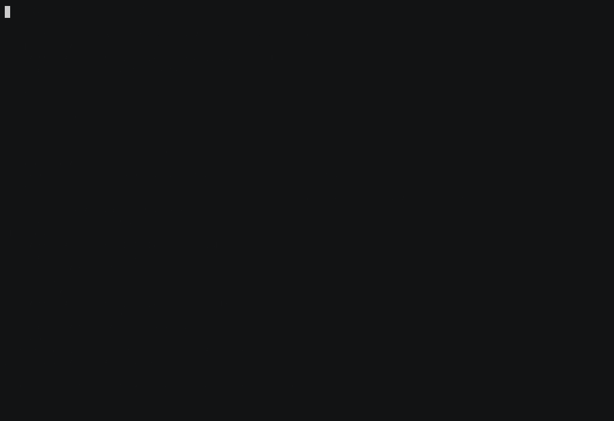
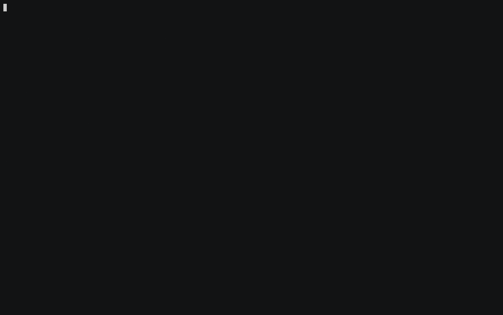

# DogPaddle

**一条 SQL，持续维护数据库中的结果。**

```text
PostgreSQL / MySQL  ── 一致快照 + CDC ──▶  SQL  ──▶  PostgreSQL / SQLite / ClickHouse / Doris
```

DogPaddle 是一个本地运行、可恢复的增量 SQL 引擎。它先读取源表的一致快照，再持续消费 WAL 或 binlog；源记录被新增、修改或删除时，筛选、Join、聚合和时间匹配产生的结果随之改变。进程重启后，从已提交的位置继续。

下面的动图记录真实数据库写入和 DogPaddle 运行结果。每个场景对应的完整 SQL、建表语句和逐步操作都保存在 [`examples/`](examples/)，可以在本地重新运行。

[](https://github.com/frelion/dogpaddle/actions/workflows/ci.yml)
[](https://github.com/frelion/dogpaddle/actions/workflows/debezium-postgres.yml)

## 1. 让另一张表跟着源表变化

初次运行把 `sales.events` 的现有记录写入目标。此后的新增、修改和删除继续反映到 `warehouse.events_sync`。


```sql
INSERT INTO postgres(
    connection => env('DOGPADDLE_EVENT_SYNC_TARGET'),
    table => 'warehouse.events_sync'
)
SELECT event_id, payload
FROM postgres_cdc(
    connection => env('DOGPADDLE_EVENT_SYNC_SOURCE'),
    table => 'sales.events',
    publication => 'dogpaddle_demo_publication'
);
```

[运行 event-sync example](examples/event-sync/)

## 2. 订单付款后进入履约队列

待付款订单不在目标关系中。付款后结果出现；数量或单价改变时，金额和处理通道被替换；订单取消后，原结果被撤回。


```sql
INSERT INTO postgres(
    connection => env('DOGPADDLE_ORDER_ETL_TARGET'),
    table => 'ops.fulfillment'
)
SELECT
    order_id,
    quantity * unit_price_cents AS amount,
    CASE WHEN quantity * unit_price_cents >= 40000
         THEN 'priority' ELSE 'standard' END AS lane
FROM postgres_cdc(
    connection => env('DOGPADDLE_ORDER_ETL_SOURCE'),
    table => 'sales.orders',
    publication => 'dogpaddle_demo_publication'
)
WHERE status = 'paid';
```

[运行 order-etl example](examples/order-etl/)；[完整履约 example](examples/order-fulfillment/)还包含折扣、地区路由、`UNION ALL` 和崩溃恢复验收。

## 3. 客户等级变化后更新已有订单

订单保存在 PostgreSQL，客户等级保存在 MySQL。新订单会关联当前客户等级；客户从普通用户变为 VIP 或 Gold 时，已经存在的订单结果也会更新。


```sql
INSERT INTO postgres(
    connection => env('DOGPADDLE_CUSTOMER_ORDERS_TARGET'),
    table => 'analytics.enriched_orders'
)
WITH orders AS (
    SELECT order_id, customer_id, status
    FROM postgres_cdc(
        connection => env('DOGPADDLE_ORDERS_SOURCE'),
        table => 'sales.orders',
        publication => 'dogpaddle_customer_orders'
    )
),
customers AS (
    SELECT customer_id, segment
    FROM mysql_cdc(
        connection => env('DOGPADDLE_CUSTOMERS_SOURCE'),
        table => 'crm.customers'
    )
)
SELECT orders.order_id, orders.customer_id, customers.segment
FROM orders
JOIN customers
    ON orders.customer_id = customers.customer_id
WHERE orders.status = 'paid';
```

[运行 customer-order-enrichment example](examples/customer-order-enrichment/)；[`payment-reconciliation`](examples/payment-reconciliation/) 用 `FULL OUTER JOIN` 保留尚未匹配、金额不符和只有单侧记录的支付对账项。

## 4. 成交匹配当时最近的报价

每笔成交匹配相同证券在成交时刻之前最近的一条报价。补录更接近成交时间的历史报价后，已经输出的成交会改配；修正或撤回这条报价时，成交质量结果再次变化。



```sql
INSERT INTO postgres(
    connection => env('DOGPADDLE_EXECUTION_QUALITY_TARGET'),
    table => 'analytics.execution_quality'
)
SELECT
    fills.trade_id,
    fills.symbol,
    fills.executed_at,
    fills.side,
    fills.price_cents AS execution_price_cents,
    quotes.quoted_at,
    (quotes.bid_cents + quotes.ask_cents) / 2 AS arrival_mid_cents,
    CASE
        WHEN fills.side = 'BUY'
            THEN fills.price_cents - (quotes.bid_cents + quotes.ask_cents) / 2
        ELSE (quotes.bid_cents + quotes.ask_cents) / 2 - fills.price_cents
    END AS slippage_cents
FROM postgres_cdc(
    connection => env('DOGPADDLE_FILLS_SOURCE'),
    table => 'market.fills',
    publication => 'dogpaddle_fills'
) AS fills
ASOF JOIN postgres_cdc(
    connection => env('DOGPADDLE_QUOTES_SOURCE'),
    table => 'market.quotes',
    publication => 'dogpaddle_quotes'
) AS quotes
MATCH_CONDITION (fills.executed_at >= quotes.quoted_at)
ON fills.symbol = quotes.symbol;
```

[运行 trade-quote-asof example](examples/trade-quote-asof/) · [查看原始终端录制](docs/assets/readme-trade-quote-asof.cast)

## 5. 退款发生后修正门店销售汇总

每个门店只有一条当前汇总。订单付款会增加计数和营收；改价会替换旧贡献；退款会减少汇总。门店最后一笔已付款订单退出后，整个分组消失。



```sql
INSERT INTO postgres(
    connection => env('DOGPADDLE_STORE_SALES_TARGET'),
    table => 'analytics.store_sales'
)
SELECT
    store_id,
    COUNT(*) AS order_count,
    SUM(amount_cents) AS revenue_cents,
    AVG(amount_cents) AS average_order_cents,
    MIN(amount_cents) AS smallest_order_cents,
    MAX(amount_cents) AS largest_order_cents
FROM postgres_cdc(
    connection => env('DOGPADDLE_STORE_SALES_SOURCE'),
    table => 'sales.store_orders',
    publication => 'dogpaddle_store_sales'
)
WHERE status = 'paid'
GROUP BY store_id;
```

[运行 store-sales-summary example](examples/store-sales-summary/) · [查看原始终端录制](docs/assets/readme-store-sales-summary.cast)

## 中断后继续

DogPaddle 把输入位置、拓扑和算子状态保存在本地 state 目录。重新执行同一条命令会打开已有状态；状态损坏、不完整、被其他进程占用或属于另一份 SQL 时会报错，不会删除或重新构建已有状态。

[订单履约演示](docs/demo/)包含一次真实的进程终止和恢复，恢复后继续处理订单的新增、修改和删除。演示使用的仍是仓库中的[完整 pipeline.sql](examples/order-fulfillment/pipeline.sql)。

## 快速开始

不连接外部数据库的 quickstart 使用内置 `sequence` 数据源，筛选偶数并持续写入 SQLite。源码构建需要 Rust 1.96：

```sh
git clone https://github.com/frelion/dogpaddle.git
cd dogpaddle

example_dir="$(mktemp -d /tmp/dogpaddle-quickstart.XXXXXX)"
export DOGPADDLE_QUICKSTART_SQLITE="$example_dir/results.sqlite"

cargo run --locked -p dogpaddle -- \
  run crates/sql/examples/quickstart.sql --state "$example_dir/state"
```

按 `Ctrl-C` 后查看结果：

```sh
sqlite3 -readonly -header -column "$DOGPADDLE_QUICKSTART_SQLITE" \
  'SELECT number, square, size FROM even_squares ORDER BY number LIMIT 10;'
```

再次执行相同的 `dogpaddle run` 命令会从已提交位置继续。

生产发行包可以从 [GitHub Releases](https://github.com/frelion/dogpaddle/releases) 下载；其中包含固定版本的 Debezium 和 JRE，无需安装 Rust 或系统 Java，也不执行系统安装。解压 `.tar.gz` 后直接运行其中的 `bin/dogpaddle`，并保留完整目录，使它能从同一安装根加载 `libexec/dogpaddle/debezium`。安装目录可以只读，运行状态写入 `--state` 指定的目录。

原生发行包当前覆盖 `x86_64`、`aarch64` 的 GNU/Linux 与 macOS。Linux 以 glibc 2.28 为最低用户态 ABI，并静态链接 DogPaddle 使用的 C++ compiler runtime；macOS 以 macOS 11.0 为最低 deployment target。每个 archive 都在发布前检查 OS ABI、包内动态库引用和 CPU 架构，并在没有系统 Java、空 `PATH`、只读安装目录下完成首次构建与 reopen smoke。JRE 中未被 DogPaddle headless 路径加载的桌面模块可能仍声明 X11 或 ALSA 动态库；它们记录在随 release 发布的 `compatibility.txt` 中，不属于 DogPaddle 运行路径。

macOS archive 不做 Developer ID 签名或 Apple notarization。若 Gatekeeper 阻止从互联网下载的 executable，用户需要在系统设置中手动允许运行。

产品命令只有：

```text
dogpaddle run SQL_FILE [--state DIR]
```

## 当前能力与边界

| 维度 | 当前支持 |
| --- | --- |
| 数据源 | PostgreSQL CDC、MySQL CDC；一致初始快照与后续 WAL/binlog |
| SQL | `SELECT`、`WHERE`、表达式、普通 `JOIN`、动态 `ASOF JOIN`、`GROUP BY`、`DISTINCT`、`UNION ALL` |
| 普通 Join | Inner、Left/Right/Full Outer、Left/Right Semi、Left/Right Anti，以及 residual 条件 |
| 聚合 | 非空分组上的 `COUNT`、`SUM`、`AVG`、`MIN`、`MAX` |
| 目标端 | PostgreSQL、SQLite、ClickHouse、Doris |
| 恢复 | 本地持久化输入位置、拓扑和算子状态 |

DogPaddle 仍处于早期开发阶段。当前每个 SQL 文件只接受一条 `INSERT INTO sink(...) <query>`；CDC 读取单表并要求固定 Schema，暂不支持 TLS、在线 DDL 或多表路由。数据库目标关系由 DogPaddle 独占。当前 v1 状态格式不提供迁移；修改查询语义或持久 endpoint identity 时应使用新的 state 路径。完整约束见 [SQL 文档](crates/sql/README.md)。

## 文档

- [全部可运行 examples](examples/)
- [SQL、端点与运行方式](crates/sql/README.md)
- [完整订单履约与恢复演示](docs/demo/)
- [构建、测试与性能验证](TESTING.md)
- [底层 Flow API](crates/flow/README.md)
