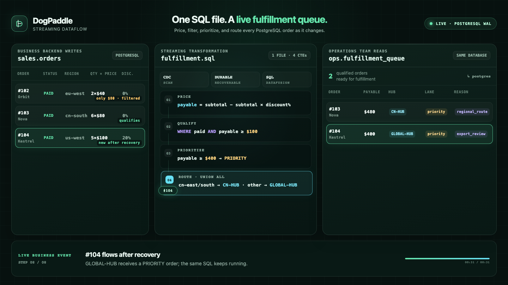

# DogPaddle

**用 SQL 持续处理数据变化，把结果写进数据库。**

DogPaddle 是一个嵌入 Rust 应用的流处理引擎。你用 SQL 指定数据从哪里来、如何筛选和计算、
写到哪里；它负责处理后续变化，并把处理进度保存在本地，供程序重启后继续运行。

例如，把订单表中的已付款订单转换成履约队列：新订单进入队列，订单修改后重新计算，
订单删除后撤回对应结果。业务后端只需写订单表。

```text
PostgreSQL / MySQL 数据变化  →  SQL 筛选、计算、分流  →  PostgreSQL / SQLite 结果表
```

目前适合本地实验和 Rust 应用集成验证。项目仍在早期开发，PostgreSQL 与 MySQL 接入均处于试点阶段。

[快速上手](#快速上手) · [嵌入 Rust 应用](#嵌入-rust-应用) · [当前支持什么](#当前支持什么) · [订单演示](#订单演示)

[](https://github.com/frelion/dogpaddle/actions/workflows/ci.yml)
[](https://github.com/frelion/dogpaddle/actions/workflows/debezium-postgres.yml)

## 快速上手

先跑一个本地例子：**生成递增数字 → 筛选偶数 → 计算平方 → 写入 SQLite**。
这个例子不需要 PostgreSQL 或 Java，还能直接验证程序退出后是否可以接着处理。

准备 Rust 1.96（仓库已固定版本）和 `sqlite3` 命令行。以下命令适用于 macOS / Linux，
首次运行需要编译依赖。

### 1. 获取代码，看看 SQL

```sh
git clone https://github.com/frelion/dogpaddle.git
cd dogpaddle
```

仓库已包含 [quickstart.sql](crates/sql/examples/quickstart.sql)，无需另建文件：

```sql
INSERT INTO sqlite(
    path => env('DOGPADDLE_QUICKSTART_SQLITE'),
    table => 'even_squares'
)
WITH numbers AS (
    SELECT CAST(sequence.value AS BIGINT) AS number
    FROM sequence(start => 0)
)
SELECT
    number,
    number * number AS square,
    CASE WHEN number >= 10 THEN 'large' ELSE 'small' END AS size
FROM numbers
WHERE number % 2 = 0;
```

`FROM sequence(...)` 持续生成数字，`SELECT ... WHERE ...` 定义计算规则，
`INSERT INTO sqlite(...)` 指定结果文件和表名。`env(...)` 从环境变量读取文件路径。

### 2. 运行并查看结果

在仓库根目录执行：

```sh
demo_dir="$(mktemp -d /tmp/dogpaddle-demo.XXXXXX)"
export DOGPADDLE_QUICKSTART_SQLITE="$demo_dir/results.sqlite"

cargo run --locked -q -p dogpaddle-sql --example quickstart -- \
  build crates/sql/examples/quickstart.sql "$demo_dir/flow" 12 0

sqlite3 -readonly -header -column "$DOGPADDLE_QUICKSTART_SQLITE" \
  'SELECT number, square, size FROM even_squares ORDER BY number;'
```

查询结果：

```text
number  square  size
------  ------  -----
0       0       small
2       4       small
4       16      small
6       36      small
8       64      small
```

这里运行的是仓库提供的 Rust 示例程序。`build` 创建一条处理流程（Flow），
`"$demo_dir/flow"` 保存进度，`results.sqlite` 保存结果。最后的 `12 0` 表示推进 12 轮、
每轮等待 0 毫秒；轮数不等于结果行数。示例跑完这些轮次便退出。

### 3. 从上次进度继续

在**同一个终端**中执行，把 `build` 换成 `open`，沿用 SQL、进度目录和结果文件：

```sh
cargo run --locked -q -p dogpaddle-sql --example quickstart -- \
  open crates/sql/examples/quickstart.sql "$demo_dir/flow" 6 0

sqlite3 -readonly -header -column "$DOGPADDLE_QUICKSTART_SQLITE" \
  'SELECT number, square, size FROM even_squares ORDER BY number;'
```

原来的五行仍在，另外增加两行：

```text
10      100     large
12      144     large
```

这次运行从保存的进度继续，已有结果没有重复写入。

## 嵌入 Rust 应用

SQL 描述处理规则，Rust 应用控制何时运行和停止。核心用法如下：

```rust
use dogpaddle_sql::SqlProgram;

let program = SqlProgram::read("flow.sql")?;
let mut flow = program.build("./flow-state")?;
flow.advance()?; // 推进一轮；由应用重复调用，持续处理数据

drop(flow);
let mut flow = program.open("./flow-state")?;
flow.advance()?; // 重启后继续
```

DogPaddle 在应用进程内运行，目前没有独立服务或内置后台运行循环。
完整可运行代码见 [quickstart.rs](crates/sql/examples/quickstart.rs)，
接口说明见 [SQL 文档](crates/sql/README.md#嵌入-rust)。

## 当前支持什么

| 你想做的事 | 当前支持 |
| --- | --- |
| 读取数据 | 递增数字源；PostgreSQL WAL / MySQL binlog 单表变更捕获（固定 Schema 试点） |
| 筛选和计算 | `SELECT`、`WHERE`、算术与布尔表达式、`CASE`、`CAST`、`TRY_CAST` |
| 组织查询 | 字段别名、非递归 CTE、派生查询、`SELECT DISTINCT`、`UNION ALL` |
| 分组聚合 | 非空 `GROUP BY`；`COUNT`、`SUM`、`AVG`、`MIN`、`MAX`；只分组不聚合 |
| 写入结果 | SQLite；PostgreSQL（试点）；丢弃输出 |
| 停止后继续 | 本地保存流程、处理进度和算子状态，重新打开后恢复 |

开始接入前，需要了解这些边界：

- **SQL 范围有限。** 每个文件只接受一条 `INSERT INTO ... SELECT ...`。暂不支持 Join、无分组的
  全局聚合、grouping sets、聚合修饰符或 UDF，也不支持 `DISTINCT ON`、普通 `UNION`、排序、
  Limit、窗口和交互式查询结果。
- **聚合类型范围有限。** 分组字段不能包含浮点值；`SUM/AVG` 只接受 `Int64/UInt64`，`MIN/MAX`
  只接受非浮点的扁平 DogPaddle scalar。`COUNT(*)` 和 `COUNT(expression)` 均可使用。
- **去重采用精确记录身份。** `SELECT DISTINCT` 比较完整 canonical 记录；浮点值按
  原始位模式区分，因此 `-0.0` 与 `+0.0` 不会像常见 SQL / `DataFusion` 分组那样合并。
- **PostgreSQL 会先复制已有数据，再持续处理 WAL 变化。** 试点要求预先配置 publication、
  `REPLICA IDENTITY FULL` 和一个首次启动前必须不存在、之后由该 Scan 独占的 slot 名。初始快照在私有持久
  spool 中完整封口后才对下游发布，因而无需要求源表为空或先停写。需要显式配置能容纳完整快照及
  快照封口前 WAL 重叠的 `bootstrap_spool_bytes`。目前仍不支持 TLS、DNS 地址、多表路由或运行中改表。
  详见 [外部端点文档](crates/operation/README.md)。
- **MySQL 会先复制已有数据，再从同一快照切点继续 binlog CDC。** MySQL 8.4 试点使用
  `initial_only` 和 `minimal` locking 取得一致快照，封口后从 initial-snapshot completion
  notification 的 checkpoint 以
  `recovery` 继续。快照也会先写入受 `bootstrap_spool_bytes` 限制的私有持久 spool，完整后再逐批发布。
  binlog 必须覆盖初始快照、私有 spool 排空、公开 output 背压和追平的全部时间；过早 `PURGE`
  会以错误终止，不会悄悄跳过数据。要求固定 Schema，不支持运行中 DDL、TLS 或未列出的源类型。
  详见 [外部端点文档](crates/operation/README.md)。
- **结果表由 DogPaddle 独占。** SQLite / PostgreSQL 输出必须使用新目标表，不能接管已有表或
  与业务代码共同写入。PostgreSQL 结果表不复制源表结构，文本当前按 bytes 保存。
- **恢复沿用原来的处理规则。** 修改 SQL 后请使用新进度目录和新目标表；`open` 不会更新已有流程。
  同一进度目录同时只能由一个活动 Flow 使用。开发期持久格式不承诺跨版本迁移。

## 订单演示

[fulfillment.sql](crates/sql/examples/fulfillment.sql) 展示了一个真实 PostgreSQL 场景：
从 `sales.orders` 读取变化，计算折后金额，筛选已付款且金额达标的订单，再按地区和金额分配
履约中心与优先级，写入同一数据库的 `ops.fulfillment_queue`。

无声演示固定展示源表、完整 `fulfillment.sql` 文件、目标表。源表连续发生 28 次新增、修改和删除，
目标表随之筛选、重算、切换路由或撤回结果；SQL 从端点到最后一行全程可见，变化的行和字段会高亮。

[](docs/assets/fulfillment-continuous.mp4)

[观看视频](docs/assets/fulfillment-continuous.mp4) · [本机复现与原始记录](docs/demo/README.md)

画面来自真实 PostgreSQL 执行记录，保留原始数据供核对；每次变更留出观察时间，不代表实际处理延迟。

## 文档

- **使用：** [SQL 语法与端点参数](crates/sql/README.md) · [Flow 运行与恢复](crates/flow/README.md)
- **实现：** [算子与数据库接入](crates/operation/README.md) · [Arrow 数据模型](crates/change/README.md) ·
  [事务存储](crates/store/README.md) · [Debezium runtime](crates/debezium/README.md)
- **开发：** [构建、测试与性能验证](TESTING.md) · [算子路线图](OPERATOR_ROADMAP.md) ·
  [Debezium 接入路线图](DEBEZIUM_ROADMAP.md)
