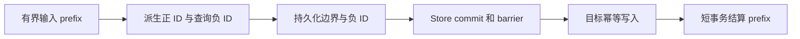

# 以事件位置统一 Sink 的进度与身份

这是一份 2026 年 9 月 30 日的架构提案与验证记录，基于 `3becbf9`，下文保留提案阶段的证据与取舍。2026 年 10 月 1 日已完成产品实现；当前规范由 [Operation README](../../crates/operation/README.md) 和 [Sink 契约](../../crates/operation/docs/sinks.md) 拥有，产品性能结果见 [性能对照](../../crates/operation/PERFORMANCE.md)。

本轮确定的方向是：**一条加权输入占据连续的绝对事件区间，正 occurrence 的 ID 就是它在区间中的位置。** outbox 仍保存原来的 IPC 加权行。一个日志位置同时表达交付进度和正 ID，不另外保存 allocator、pending events 和持久 remaining。

四种目标继续保存普通 SQL 行，保留8字节逻辑ID与整数目标类型。目标事务仍有界，重复行仍由目标原生读取。实际净减代码和性能结论要等产品完整 diff 与正式验收；本轮完成的是算法切片与设计审查。

## 用一个例子理解新表示

```text
原始输入          逻辑事件区间       正 ID / 固定删除
(r, +3)           [100, 103)          100, 101, 102 → r
(s, +1)           [103, 104)          103 → s
(r, -2)           [104, 106)          删除 100, 101
```

负事件也占据日志位置，但不会产生新 occurrence。最后 live bag 是 ID102 的 r 和 ID103 的 s；tail 为106。把第一行分三次交付，正 ID 仍是100、101、102。

这不是展开持久日志：三条 IPC 加权行仍只有三条，只按 `sum(abs(diff))` 给 entry 定义位置区间。不会写六条 log records，也不会存逐份来源映射。

## 最小状态与数据形状

```rust
struct Position {
    entry_start: u64,
    event_offset: u64,
}

struct BufferState {
    head: Position,
    tail: u64,
    retained_bytes: u64,
}

struct DeliveryBatch {
    change: Change,
    first_event_offset: u64,
}

enum State {
    Initialize,
    Ready(BufferState),
    Prepared {
        before: BufferState,
        after: BufferState,
        negative_ids: Vec<u64>,
    },
}
```

待处理绝对事件数为 `tail - head.event_offset`。entry key 是其第一个绝对事件位置。head 保存 entry key，以便直接点查部分消费的 IPC entry；不能只保存全局位置再扫描前驱 entry。

在 decoded entry 中按 `abs(diff)` 前缀找到 head 的位置，就能得到原 row_index 和 remaining。它们成为局部派生值，不再是持久事实。Delivery 的第 i 行正 ID 从 `first_event_offset + sum(abs(此前切片行的 diff))` 起。只需要一个 origin 标量。

负 ID 取决于目标已有的 occurrence，无法只从输入推导。Prepared 按原负事件顺序固定全部负 ID，包括本批次产生的新 ID；不再把它们分成“可派生”与“旧”两个类别。重开从保留输入重建正 ID 和负项 row_index，不重新 lookup。

## 日志容量与结算

合法事件位置为 `1..u64::MAX`，exclusive tail 最多为 `u64::MAX`。从1起的 entry 消耗其完整 `sum(abs(diff))` 区间；在任何写入前 checked 计算末尾位置。超过范围必须返回终止错误，不能用暂时拒绝的 false 让 Flow 永远重试。

空状态是 `head.entry_start == head.event_offset == tail` 且 retained_bytes 为零。tail 不重置。耗尽且排空的 Ready 仍能合法重开与读取。

旧 Sink 从空目标起，全部合法历史中累计正 occurrence 最多为 i64::MAX，负 occurrence 不超过累计正 occurrence，因此总绝对事件最多为 `2*i64::MAX == u64::MAX-1`。这个位置域覆盖旧有限容量下的合法历史；新合同不再以正 ID 总数单独限流。

结算删除实际完整消费的 entry key，禁止遍历区间内的每个整数 key。重开验证相邻 key 等于前一 key 加该 entry 的绝对事件数，验证 head 确实落在 entry 的合法区间。仍逐页检查完整 outbox 的 schema、IPC framing、Change value、事件区间和 retained bytes。

## 交付与恢复边界



仍使用 Initialize、Ready、Prepared 与现有 `load → prepare → persist → barrier → deliver → settle`。没有新增 phase、receipt、远端 allocator 或本地关系镜像。

纯正批保留免 lookup、免 canonical 分组路径。混合批保留完整 canonical row 分组、最大负前缀缺口检查及最多1024个 existing ID 的查询；deque 先消费旧 ID，再消费本批正 ID。`+3/-3` 可消耗同批新 ID，后面的正事件不能修复前面的非法负前缀。

目标返回的 existing ID 必须小于批次首事件位置，并保持有序、唯一、数量有界。恢复验证 exact prefix、负 ID 数量与顺序、ID 范围、重复 ID，以及本批正 ID 的原始完整行对应。对于仍保留在 outbox 中的历史区间，还能验证负 ID 落在正事件段并匹配其出生行。

这项出生检查需要原始 head entry；仅有 sliced Change 与首事件标量并不够。BufferedSink 在其现有有界读取中保留原 Change 的短命引用；跨多个 entry 时不能被最后一次 cache 更新覆盖，也不能让 RelationTarget 回头读取 Store 或隐式开事务。把本页最多1024个待验证旧 ID 临时排序，顺序扫描 entry 的 diff 区间，只对命中的出生行做受现有 canonical 字节预算约束的比较，禁止每个 ID 从头重扫或提前 canonical 化整个 entry。原 entry 的保留也须进入现有动作资源计费；不新增持久 prefix index 或历史镜像。

需要明确退休一项旧检查：旧 ID 分配域是连续出生集合，`id < checkpoint` 可以证明该 ID 曾经出生；新日志位置包含负事件空隙。已经回收的历史 entry 无法再证明一个过去位置曾是正事件。临时模型提供了损坏 Prepared 指向历史负空隙的反例：缺失 delete 会按既有重放规则成功，真实 live ID 未被删除。不能宣称保留全部旧损坏拒绝能力。

本方案保留独占 writer、严格当前输入/控制编码和目标完整行 guard 的边界，接受这个历史出生成员检查的变化；不增加历史 birth interval 表去重新建立一份分配事实。它不提供针对任意语义自洽 Prepared 篡改的 receipt 证明。实现时必须把上述区分写入当前 owner 契约并保留反例测试。

SQLite/PG 仍在一个显式目标事务中先插后删；不确定提交仍 fail-stop/reopen，在结算前重投同一 Prepared。它们原有物理删除协议不承诺任意重投早已结算的正批次。Doris/ClickHouse 保留逐 occurrence 终态 tombstone 与旧 live 防复活规则。

## 真正可以删除的机制

| 现有机制 | 新表示 |
| --- | --- |
| Ready、Prepared、Header 的 allocator checkpoint | 删除；Ready 直接保存 BufferState |
| checkpoint codec、`validate_next_id` | 删除 |
| 正 ID 全量容量预留及其 reopen 证明 | 删除；只保留日志位置容量与资源准入 |
| `DeliveryBatch.admissions` 与首次切片 reservation | 删除；一个 first_event_offset |
| planner 的 allocated/next_id/frontier 推进 | 正 ID 是日志位置 |
| 持久 plan 的正 Insert 数组 | 删除；从原 prefix 重建 |
| 负 plan 的 row_index | 删除；按负事件顺序重建 |
| 持久 pending_events | 删除；tail 减 head |
| 持久 row_index、remaining | 删除；从 entry 区间派生 |
| optional empty head 与空 buffer 序号重置 | 删除；head 等于永久 tail |

当前持久 mutation 每项是 `row_index8 + technical_id8`。新负项只有8字节 ID；纯正 Prepared 只需固定 prefix 边界。控制 Ready 的候选固定宽度为34字节，当前最多59字节。短命 target Batch 仍可构建 Insert/Delete 数组，不把删除持久记录误说成删除物理写入。

保留1024 mutations、8MiB encoded delivery/expanded work、64MiB retained outbox、1,048,576 buffered absolute events、完整行 equality、strict codec/schema guard、deadline、ownership/layout 和 Store barrier。删除 allocator 不授权更大单事务，也不授权更大的加权输入。

## 目标类型与性能成本

内部 ID 仍是 u64。SQLite、PG、Doris 使用现有 signed64 key 类型：SQL 值是 ID 的最高位翻转后按 i64 解释；decode 做逆变换。这个双射保持 unsigned ID 顺序，SQLite 继续用 INTEGER PRIMARY KEY rowid alias。SQL 值可以是负数或零；旧正整数技术 ID 合同退休。ClickHouse 继续用 UInt64。二进制持久 ID 仍为8字节。

SQLite 负 rowid 的 varint 可能比当前小正数占更多字节，PG/Doris literal 也可能增加负号。必须按新极值校准 target `event_bytes`、wire/SQL literal 上界和目标 layout，不把逻辑8字节说成实际存储零成本。ordinary bag 原生读取路径保留，吞吐、索引/cache 与目标空间仍需正式测试。

一个 SQLite3.51 native SQL 临时对照中，10万行、每行64字节text、相同hash索引：小正rowid文件12,038,144字节，映射后的负rowid13,234,176字节，约增加9.9%；单轮1024行事务插入约0.457s与0.500s。1000行64KiB宽行的文件差异约4KiB。它量化了可能的代价，包含Python binding与本机I/O，不是产品Sink benchmark，不能用于保证或判定最终吞吐。

移除持久 row_index 会增加 entry 内定位工作：大 entry 拆成许多小 target page 时，从头定位每页会产生重复扫描。当前 load_entry 已有 cache 命中直接 clone 的快路径，settle 又会清空缓存；不能以旧实现也可能 decode 来抵消新增扫描成本。先测实际 Load 路径；可以利用已有单 entry cache 缓存经校验的 span 与可丢弃定位提示，不能新增永久 prefix index。rollback/retry 必须以 Store head 为准，位置不匹配就重新验证；缓存不能成为第二份进度事实。

旧状态和受影响目标按开发期 v1 重建，不增加 alias、fallback、旧格式读取或迁移。恢复失败不能删除旧状态。

## 已运行验证

临时 std-only Rust2024 模型用 Rust1.96、`-D warnings` 编译运行，覆盖1280种 entry/page/copy切分、300个随机流各两种切片、每页未提交/不确定成功提交后的同 Prepared replay、`+3/-3`、负前缀、直接 entry 定位、稀疏结算、空队列再次入队、耗尽 tail 重开模型和先拒后写、signed64 roundtrip/排序，以及前述历史负空隙的明确限制。

模型没有 RocksDB、Arrow/IPC、严格持久 codec、真实四库事务、网络故障、canonical类型/hash碰撞或产品 benchmark。map clone只模拟原子提交。没有产品代码变更，也没有宣称工作区完整 gate 通过。

## 被否决的候选与研究证据

先验证了每个 canonical row 只存 `{birth,count,version}`、每批写最终数量。算法确实把千万份变成一条 Set，并通过随机切分、归零重插和旧版本重放。但 ordinary SQL 必须展开 count，真实 SQL 暴露了成本：

- SQLite 全局 rank 会被无关 MAX 权重拖住一行查询；固定 radix 修复过滤，却让10万 distinct、全 weight=2 的 COUNT约1.94s，物理表约0.122ms。
- PostgreSQL17.10 target-list ProjectSet 的流式 LIMIT和小bag语义通过，尚无完整写读性能验收。
- ClickHouse25.8.33.6 八层base256、view-local block16的普通查询、MAX宽行LIMIT、过滤和旧写通过，仍有 key/index 与内存成本。
- Doris4.1.3 相同64KiB行 LIMIT3，weighted MAX查询峰值约575MiB；物理10,000行基线约79MiB。512MiB quota下物理成功、weighted失败。view内 SET_VAR提示、合并生成节点、晚载payload的hashjoin均未解决。

加权目标还会让SQLite/PG永久保留完整历史零行，把纯正批次从免lookup变成逐distinct查询。它不适合作为当前四库统一默认表示。另一个128bit `(row_offset,copy_index)` 候选虽算法通过，但SQLite BLOB主键会失去rowid alias；最终线性事件位置避免了主键变宽。

这些临时单机探针用于筛选设计，不是统一 benchmark，不可跨不同数据和协议比较。没有据此承诺全面性能无回归。

## 实现完成条件

在既有 owner 内替换 control、outbox adjacency、位置映射与持久 plan，不增 generic registry、执行引擎或兼容层。同步 Operation README、Sink契约、API、layout/golden/reopen证据。

correctness必须覆盖真实 Store rollback/drop/open、IPC、多entryprefix、跨1024份切片、未来/错行ID、仍保留区间出生检查、历史空隙限制、字节预算、稀疏结算、offset耗尽和四库同Prepared replay。随后完成owner benchmark、系统验收、Clippy和 `cargo xtask check`。独立Agents分别复审冗余抽象、恢复/事务、性能/资源；只有完整实现diff才能给净减代码数字。

## 开源研究依据

[SQLite WITH 文档](https://www.sqlite.org/lang_with.html)用于核实recursive queue；[PostgreSQL ProjectSet](https://github.com/postgres/postgres/blob/REL_18_STABLE/src/backend/executor/nodeProjectSet.c)与 [FunctionScan](https://github.com/postgres/postgres/blob/REL_18_STABLE/src/backend/executor/nodeFunctionscan.c)用于区分流式SRF与tuplestore路径。

[ClickHouse ArrayJoinAction](https://github.com/ClickHouse/ClickHouse/blob/25.8/src/Interpreters/ArrayJoinAction.cpp)说明小range不代表整个pipeline内存有界。[Doris TableFunctionOperator](https://github.com/apache/doris/blob/4.1.3/be/src/exec/operator/table_function_operator.cpp)与 [HashJoinProbeOperator](https://github.com/apache/doris/blob/4.1.3/be/src/exec/operator/hashjoin_probe_operator.cpp)用于核实先构建block再裁LIMIT的复制；另有上述精确版本实测。
